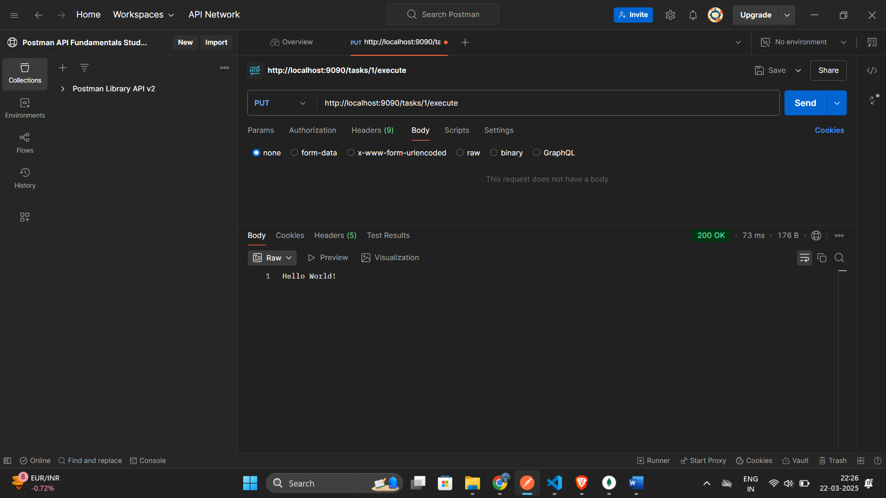

# Task Manager Backend

## Overview
This is a Spring Boot-based backend application for task execution. It provides REST APIs to create, retrieve, and execute tasks. Task execution details are stored in a database.

## Features
- Create, retrieve, and delete tasks.
- Execute tasks and track execution details.
- Store tasks using MongoDB.

## Prerequisites
- Java 17+
- Maven
- MongoDB
- Postman or cURL (for endpoint testing)

## How to Start
1. **Clone the Repository**
   ```sh
   git clone <repository-url>
   cd <project-directory>
   ```
2. **Run the Application**
   ```sh
   mvn spring-boot:run
   ```
3. **Default Port**
   - The application starts on port `9090` by default.
   - To change it, update `application.properties`.
4. **Test APIs**
   - Use Postman or cURL to test the endpoints.

---

## API Working Examples
### 1. Create a Task
**Endpoint:** `POST http://localhost:9090/tasks/create`


### 2. Malicious Task Attempt
**Example of preventing a malicious task:**


### 3. Get All Tasks
**Endpoint:** `GET http://localhost:9090/tasks`


### 4. Get Task by ID
**Endpoint:** `GET http://localhost:9090/tasks/{id}`
- Replace `{id}` with an existing task ID.


### 5. Search Task by Name
**Endpoint:** `GET http://localhost:9090/tasks/search?name={task_name}`
- Replace `{task_name}` with the actual task name.

### 6. Execute a Task
**Endpoint:** `PUT http://localhost:9090/tasks/{id}/execute`
- Replace `{id}` with an existing task ID.



### 7. After Executing the Task
**Example response after execution:**


### 8. Delete a Task
**Endpoint:** `DELETE http://localhost:9090/tasks/{id}`
- Replace `{id}` with an existing task ID.


---

## Future Improvements
- Implement detailed logging and monitoring.
- Add role-based authentication.

## Contributors
- Srikar M

## License
This project is licensed under the MIT License.

