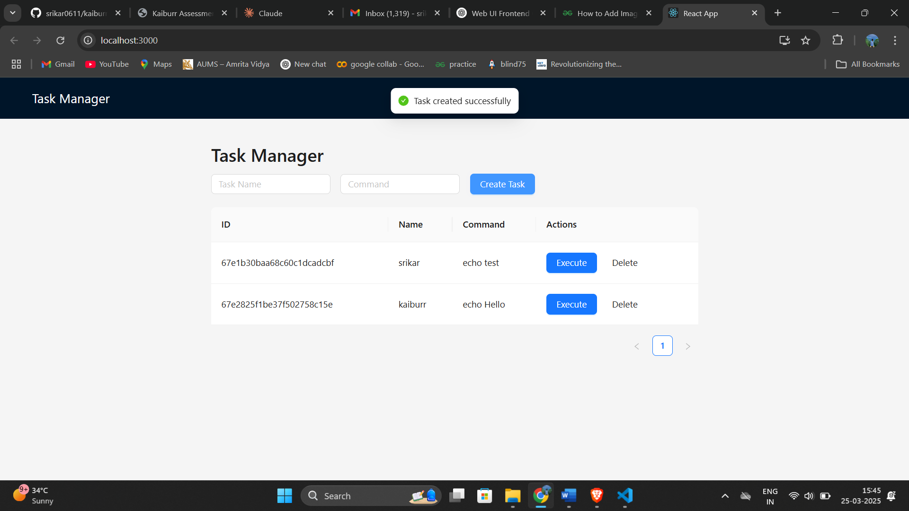
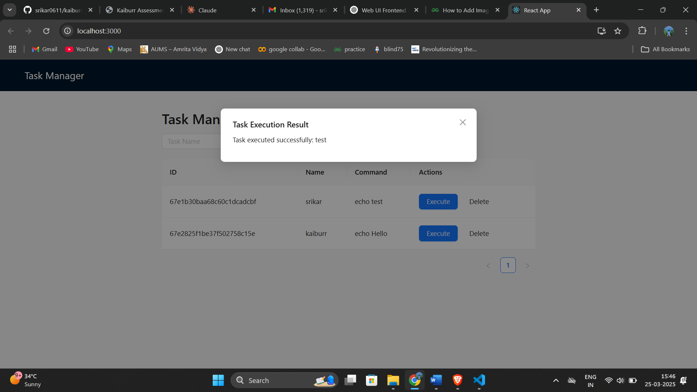
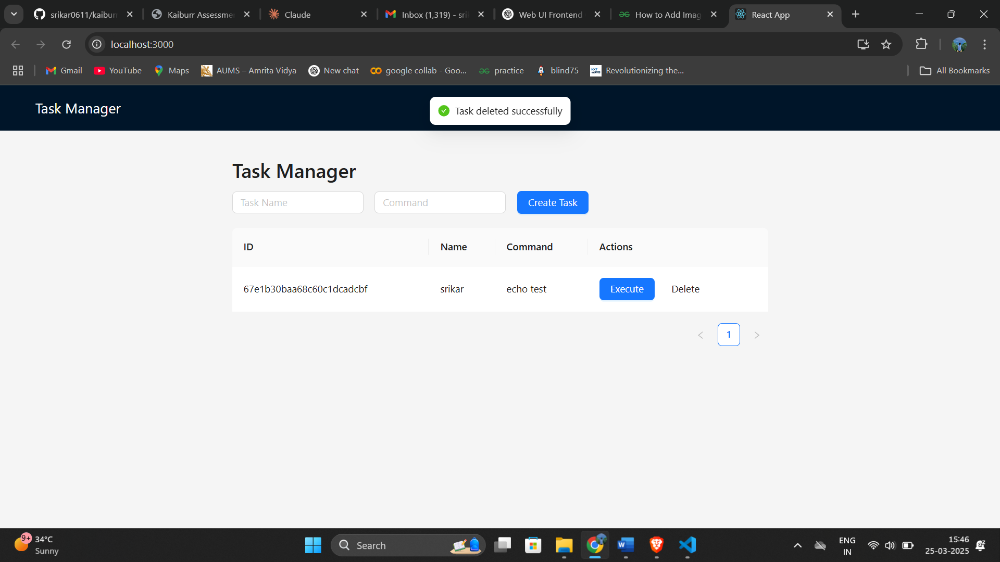

# Task Manager Frontend

This is the frontend for the Task Manager application, built using React 19, TypeScript, and Ant Design. The application allows users to create, show, search, delete records, execute commands, and view command output from a user-friendly interface.

## Features
- Create, show, search, and delete tasks
- Execute shell commands inside dynamically created Kubernetes pods
- View execution output in real time
- User-friendly and accessible UI

## Technologies Used
- **React 19**: Modern frontend framework
- **TypeScript**: Type-safe JavaScript
- **Ant Design**: UI framework for responsive and accessible design
- **Axios**: HTTP client for API requests
- **React Query**: Efficient data fetching and state management
- **Ant Design Icons**: For consistent UI elements
- **Ant Design Form Components**: For accessible and user-friendly forms

## Prerequisites
Ensure you have the following installed:
- **Node.js** (v16 or later)
- **npm** or **yarn**

## Installation
1. Clone the repository:
   ```sh
   git clone https://github.com/your-username/task-manager-frontend.git
   cd task-manager-frontend
   ```

2. Install dependencies:
   ```sh
   npm install  # or yarn install
   ```

## Configuration
Create a `.env` file in the root directory and specify your backend API URL:
```sh
REACT_APP_API_URL=http://localhost:8080/api
```

## Running the Application
To start the development server:
```sh
npm start  # or yarn start
```

The application will be available at `http://localhost:3000`.

## Usage
1. **Create a Task**: Fill out the task form and submit.
2. **Search Tasks**: Use the search bar to find specific tasks.
3. **Delete Tasks**: Click the delete button on a task.
4. **Execute Commands**: Run shell commands and view output.

## Accessibility Considerations
- Proper ARIA attributes for screen readers
- Keyboard navigability
- Color contrast for readability
- Ant Design form validation for better user experience

## Proof of work

1. Creating a task


2. Executing the task


3. Deleting a task



