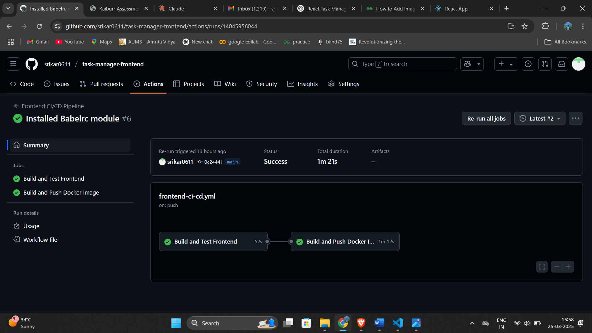

# CI/CD Pipeline for Frontend using GitHub Actions

This README explains the setup of the CI/CD pipeline for the frontend using GitHub Actions. The pipeline is designed to:

1. Install dependencies
2. Build the React application
3. Run tests (optional)
4. Build a Docker image
5. Push the Docker image to Docker Hub

## Prerequisites
Before running the pipeline, ensure you have:
- A GitHub repository for the frontend
- A Docker Hub account
- GitHub Secrets configured with Docker credentials

## Folder Structure
Ensure the GitHub Actions workflow file is located in:
```
.github/workflows/frontend-ci-cd.yml
```

## GitHub Secrets Configuration
Navigate to **GitHub → Repository → Settings → Secrets and Variables → Actions** and add:

| Secret Name        | Description |
|--------------------|-------------|
| `DOCKER_USERNAME`  | Your Docker Hub username |
| `DOCKER_PASSWORD`  | Your Docker Hub password/token |

## CI/CD Workflow File
Create the following GitHub Actions workflow file:

```yaml
name: Frontend CI/CD Pipeline

on:
  push:
    branches:
      - main
  pull_request:
    branches:
      - main

jobs:
  build:
    name: Build and Test Frontend
    runs-on: ubuntu-latest

    steps:
      - name: Checkout repository
        uses: actions/checkout@v3

      - name: Install Node.js
        uses: actions/setup-node@v3
        with:
          node-version: 18

      - name: Install dependencies
        run: npm install

      - name: Build React app
        run: npm run build

      - name: Run tests
        run: npm test --if-present

  docker:
    name: Build and Push Docker Image
    needs: build
    runs-on: ubuntu-latest

    steps:
      - name: Checkout repository
        uses: actions/checkout@v3

      - name: Log in to Docker Hub
        run: echo "${{ secrets.DOCKER_PASSWORD }}" | docker login -u "${{ secrets.DOCKER_USERNAME }}" --password-stdin

      - name: Build Docker Image
        run: docker build -t your-dockerhub-username/frontend-app:latest .

      - name: Push Docker Image to Docker Hub
        run: docker push your-dockerhub-username/frontend-app:latest
```

## Steps to Push Changes
After setting up the workflow, push your changes:
```sh
git add .github/workflows/frontend-ci-cd.yml
git commit -m "Added CI/CD pipeline for frontend"
git push origin main
```

## Expected Outcome
- On every push to `main`, the pipeline will:
  1. Install dependencies
  2. Build the React app
  3. Run tests (if enabled)
  4. Build a Docker image
  5. Push the image to Docker Hub
- Monitor the progress in the **GitHub Actions** tab.

## Troubleshooting
- Ensure GitHub Secrets for `DOCKER_USERNAME` and `DOCKER_PASSWORD` are set correctly.
- If you don't want to run tests, modify the workflow to skip them.
- Check logs in GitHub Actions for any errors.

## Conclusion
This CI/CD pipeline automates the build and deployment process for the frontend, ensuring a streamlined workflow with GitHub Actions.

## Proof of work
